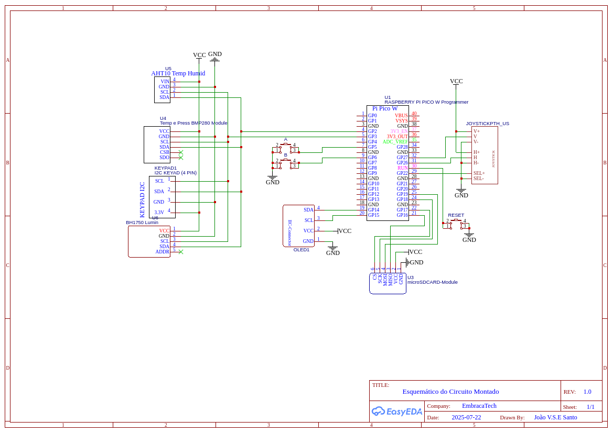

# Projeto Final - Sistema de Monitoramento Ambiental e Agrícola Inteligente

## Sistema de Monitoramento Ambiental e Agrícola Inteligente 

### Alunos: 

 João Vitor Silva do Espirito Santo 

 Leonardo de Souza Takehana 

 Yan Andrade de Sena 

### Descrição do problema 

A agricultura moderna e a gestão ambiental enfrentam desafios crescentes relacionados às 
mudanças climáticas e à necessidade de otimizar recursos. O monitoramento manual ou 
tradicional de parâmetros ambientais, como temperatura, umidade e luminosidade, é 
frequentemente impreciso, ineficiente e não fornece dados em tempo real para tomadas de 
decisão rápidas e informadas. 

Em pequenas propriedades rurais, estufas, ou até mesmo em hortas 
domésticas/comunitárias, a falta de dados ambientais precisos pode levar a: 

- Uso inadequado de água para irrigação, resultando em desperdício ou estresse 
hídrico para as plantas. 

- Condições climáticas desfavoráveis não detectadas a tempo, propiciando o 
surgimento de pragas, doenças ou danos às culturas. 

- Otimização subaproveitada de fatores como luminosidade, que são cruciais para o 
crescimento vegetal. 

- Dificuldade em registrar e analisar padrões históricos para planejamento futuro. 

Este projeto propõe uma solução para esses desafios, fornecendo um sistema de 
monitoramento ambiental em tempo real que coleta, exibe e armazena dados cruciais, 
permitindo um manejo mais eficiente e sustentável do ambiente agrícola ou de cultivo. 

### Requisitos Técnicos 

Para atender ao problema descrito, o sistema deverá cumprir os seguintes requisitos 
técnicos: 

#### Requisitos Funcionais 

- RF01 - Coleta de Dados de Temperatura e Pressão: O sistema deverá ser capaz de 
ler e coletar dados de temperatura e pressão atmosférica do ambiente. 

- RF02 - Coleta de Dados de Umidade e Temperatura: O sistema deverá ser capaz de 
ler e coletar dados de umidade relativa do ar e temperatura (em um sensor separado 
do RF01, se necessário, para redundância ou para medir em diferentes pontos). 

- RF03 - Coleta de Dados de Luminosidade: O sistema deverá ser capaz de ler e 
coletar dados da intensidade luminosa do ambiente. 

- RF04 - Exibição em Tempo Real: Os dados coletados (temperatura, umidade, 
pressão, luminosidade) deverão ser exibidos em tempo real na Tela OLED e num 
dashboard. 

- RF05 - Armazenamento de Dados: Os dados coletados (temperatura, umidade, 
pressão, luminosidade, juntamente com um timestamp) deverão ser armazenados 
em um arquivo no Cartão SD em intervalos configuráveis. 

- RF06 - Interação do Usuário (Navegação): O Joystick deverá permitir a navegação 
entre diferentes telas ou modos de operação (ex: visualização de dados, 
configuração de intervalo de log). 

- RF07 - Interação do Usuário (Seleção): Os Botões A e B deverão permitir a seleção 
de opções ou a confirmação de ações na interface do usuário. 

- RF08 - Status de Armazenamento: O sistema deverá indicar o status da gravação no 
Cartão SD (ex: "Gravando...", "Erro de SD"). 

- RF09 - Envio dos dados: O sistema deverá enviar os dados via MQTT para um 
servidor para visualização. 

#### Requisitos Não Funcionais 

- RNF01 - Confiabilidade: O sistema deve operar continuamente, coletando e 
armazenando dados de forma estável. 

- RNF02 - Precisão: As leituras dos sensores devem ter uma precisão aceitável para o 
monitoramento ambiental. 

- RNF03 - Consumo de Energia: O projeto deve considerar a otimização do consumo 
de energia para uma possível operação prolongada, embora não seja um requisito de 
bateria no momento. 

- RNF04 - Usabilidade: A interface do usuário na Tela OLED e a navegação por 
Joystick/Botões devem ser intuitivas e fáceis de usar. 

- RNF05 - Modularidade: O código deve ser modular, permitindo a fácil adição ou 
remoção de sensores e funcionalidades futuras. 

- RNF06 - Documentação: O projeto deve ser acompanhado de documentação clara 
sobre o hardware, software e procedimentos de uso. 

### Componentes

| Componente                              | Tipo de Conexão | Função/Descrição                         | Pinagem (GPIO) no BitDogLab          | Observações                                                  |
|----------------------------------------|------------------|------------------------------------------|--------------------------------------|--------------------------------------------------------------|
| BitDogLab (Pico W)                     | -                | Placa Controladora Principal             | -                                    | Base do sistema                                              |
| Botão A                                | Digital Input    | Entrada de usuário para seleção/ação     | GP5                                  | Usado para interação da UI                                   |
| Botão B                                | Digital Input    | Entrada de usuário para seleção/ação     | GP6                                  | Usado para interação da UI                                   |
| Joystick (VRx)                         | Analógico        | Eixo X do Joystick (horizontal)          | GP27                                 | Usado para navegação na UI                                   |
| Joystick (VRy)                         | Analógico        | Eixo Y do Joystick (vertical)            | GP26                                 | Usado para navegação na UI                                   |
| Joystick (Sw)                          | Digital Input    | Botão de clique do Joystick              | GP22                                 | Seleção ou confirmação na UI                                 |
| Tela OLED                              | I2C              | Display para exibição de dados e UI      | SDA: GP14, SCL: GP15                 | Feedback visual em tempo real                                |
| Sensor de Temp. e Pressão              | I2C              | Medição de temperatura e pressão         | SDA: GP1, SCL: GP2 ou GP3/GP4        | Uso de um barramento I2C disponível                          |
| Sensor de Temp. e Umidade              | I2C              | Temperatura e umidade relativa do ar     | SDA: GP1, SCL: GP2 ou GP3/GP4        | Pode compartilhar I2C com sensor anterior (endereços distintos) |
| Sensor de Luminosidade                 | I2C              | Medição da intensidade luminosa          | SDA: GP1, SCL: GP2 ou GP3/GP4        | Compartilha barramento I2C                                   |
| Cartão SD                              | SPI              | Armazenamento de dados históricos        | SCK: GP18, MOSI: GP19, MISO: GP16, CS: GP17 | GPIOs livres com suporte SPI                            |
| Extensão de conexões para sensores (I2C) | I2C              | Conecta múltiplos sensores I2C           | SDA: GP1, SCL: GP2 ou GP3/GP4        | Facilita integração dos sensores                             |

## Arquitetura do Sistema

###  Diagrama de hardware 

Na Figura abaixo está o esquemático do circuito no EasyEDA enfatizando as conexões dos periféricos ao microcontrolador. Com exceção do Display OLED, todos os outros dispositivos que usam a comunicação I2C, temperatura, umidade e pressão, compartilham do mesmo canal que usam as GPIOs 2 e 3. Os 3 dispositivos que compartilham as portas I2C estarão conectados juntos pelo extensor Keypad. O display OLED terá a comunicação por outro canal I2C nas portas GPIOs 14 e 15. Os botões A,B e Select do joystick usam GPIOs individuais, respectivamente 5,6 e 22. Os eixos analógicos do Joystick são conectados às GPIOs 26 e 27. O módulo microSDCard utiliza os pinos GP19(MOSI), GP18(SCK), GP17(CS) e GP16(MISO).

### Blocos funcionais

### Fluxograma do software

